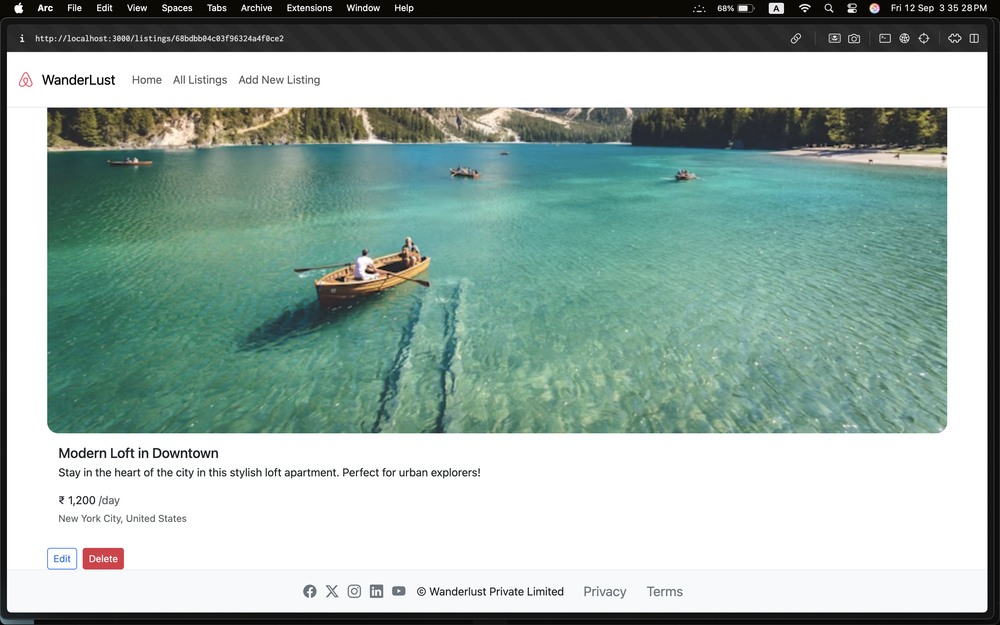
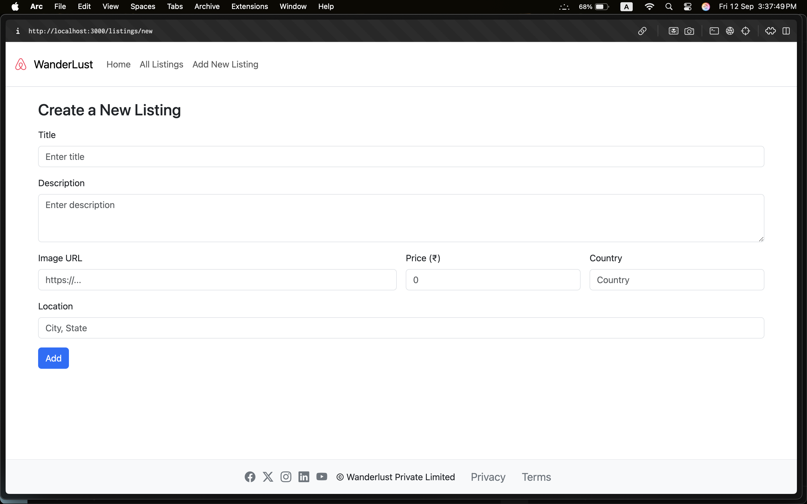

## WanderLust 🏡

<p align="center">
  <b>Airbnb-style CRUD app for travel listings built with Express, EJS, and MongoDB</b><br>
  <i>Create, edit, and browse listings with a clean, server-rendered UI</i>
</p>

<p align="center">
  
  
  
  
  
  
</p>

---

### ✨ Overview

WanderLust is a simple, educational clone of an Airbnb-style listings app. It demonstrates a classic MVC Express setup with EJS templates, MongoDB/Mongoose models, and Bootstrap-based styling. You can create, read, update, and delete listings and optionally seed the database with sample data.

---

### 📸 Screenshots

<p align="center">
  
  <br>
  <em>All Listings</em>
</p>

<p align="center">
  
  <br>
  <em>Listing Details</em>
</p>

<p align="center">
  
  <br>
  <em>Create New Listing</em>
</p>

---

### 🚀 Features

- **CRUD listings**: create, view, edit, and delete
- **Server-rendered pages** with EJS and `ejs-mate` layouts
- **Bootstrap 5** UI with icons via Bootstrap Icons / Font Awesome (CDN)
- **MongoDB** persistence with Mongoose models
- **Simple seeding** script to populate sample data

---

### 🛠️ Tech Stack

- **Node.js + Express** – server and routing
- **MongoDB + Mongoose** – data storage and schema modeling
- **EJS** – server-side templating with layout support from `ejs-mate`
- **Bootstrap 5** – responsive UI; Bootstrap Icons / Font Awesome via CDN

---

### 📁 Project Structure

```
MajorProjects/
├── app.js                  # Express app entry
├── init/
│   ├── data.js            # Sample listings
│   └── index.js           # Seeder script
├── models/
│   └── listing.js         # Mongoose Listing schema
├── public/
│   └── style.css          # Global styles
├── views/
│   ├── includes/
│   │   ├── footer.ejs
│   │   └── navbar.ejs
│   ├── layouts/
│   │   └── bolierplate.ejs
│   └── listings/
│       ├── edit.ejs
│       ├── index.ejs
│       ├── new.ejs
│       └── show.ejs
├── package.json
└── README.md
```

---

- **Layout**: `views/layouts/bolierplate.ejs` (with `ejs-mate`)
- **Partials**: `views/includes/navbar.ejs`, `views/includes/footer.ejs`
- **Pages**: `views/listings/index.ejs`, `new.ejs`, `show.ejs`, `edit.ejs`
- **Styles**: `public/style.css`

---

### 📄 License

ISC (see `package.json`).

---

<p align="center">
  <b>Happy traveling with WanderLust! ⭐️</b>
</p>
