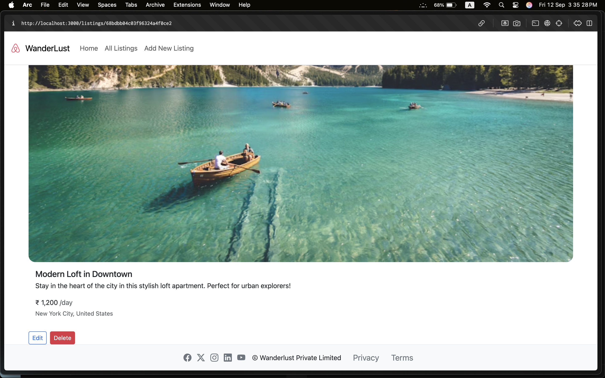
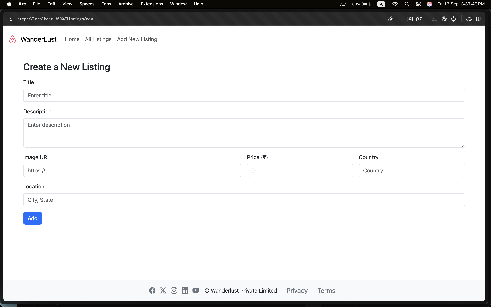

## WanderLust 🏡

<p align="center">
  <b>Airbnb-style CRUD app for travel listings built with Express, EJS, and MongoDB</b><br>
  <i>Create, edit, and browse listings with a clean, server-rendered UI</i>
</p>

<p align="center">
  
  
  
  
  
  
  
  
  
  
</p>

---

### ✨ Overview

WanderLust is a full-featured Airbnb-style travel listings application built with modern web technologies. It features user authentication, interactive maps, file uploads, and a comprehensive review system. The app demonstrates a complete MVC Express setup with EJS templates, MongoDB/Mongoose models, Passport.js authentication, and Bootstrap-based responsive UI. Users can create, browse, and manage travel listings with real-time map integration and cloud-based image storage.

---

### 📸 Screenshots

<p align="center">
  
  <br>
  <em>All Listings</em>
</p>

<p align="center">
  
  <br>
  <em>Listing Details</em>
</p>

<p align="center">
  
  <br>
  <em>Create New Listing</em>
</p>

---

### 🚀 Features

- **CRUD listings**: create, view, edit, and delete travel listings
- **User authentication**: signup, login, and session management with Passport.js
- **File uploads**: image uploads with Cloudinary cloud storage
- **Interactive maps**: Mapbox integration for location visualization
- **Reviews system**: users can add reviews and ratings for listings
- **Server-rendered pages** with EJS and `ejs-mate` layouts
- **Bootstrap 5** UI with icons via Bootstrap Icons / Font Awesome (CDN)
- **MongoDB** persistence with Mongoose models
- **Data validation** with Joi schema validation
- **Flash messaging** for user feedback
- **Responsive design** for mobile and desktop

---

### 🛠️ Tech Stack

**Backend:**
- **Node.js + Express** – server framework and routing
- **MongoDB + Mongoose** – NoSQL database with ODM
- **Passport.js** – authentication middleware (Local Strategy)
- **Express Session + Connect-Mongo** – session management with MongoDB store
- **Joi** – data validation and schema validation
- **Multer + Cloudinary** – file upload and cloud storage
- **Connect-Flash** – flash messaging for user feedback

**Frontend:**
- **EJS + EJS-Mate** – server-side templating with layout support
- **Bootstrap 5** – responsive CSS framework
- **Bootstrap Icons + Font Awesome** – icon libraries (CDN)
- **Mapbox GL JS** – interactive maps and geolocation
- **Custom CSS**  – additional styling and responsive design

**Development & Deployment:**
- **Dotenv** – environment variable management
- **Method-Override** – HTTP method override for RESTful routes
- **Nodemon** – development server with auto-restart

---

### 📁 Project Structure

```
wanderlust/
├── app.js                  # Express app entry point
├── cloudConfig.js          # Cloudinary configuration
├── middleware.js           # Custom middleware
├── schema.js               # Joi validation schemas
├── vercel.json             # Vercel deployment config
├── controllers/
│   ├── listings.js         # Listing business logic
│   ├── reviews.js          # Review business logic
│   └── users.js            # User business logic
├── models/
│   ├── listing.js          # Mongoose Listing schema
│   ├── review.js           # Mongoose Review schema
│   └── user.js             # Mongoose User schema
├── routes/
│   ├── listing.js          # Listing routes
│   ├── reviews.js          # Review routes
│   └── user.js             # User authentication routes
├── views/
│   ├── includes/
│   │   ├── footer.ejs      # Footer partial
│   │   └── navbar.ejs      # Navigation partial
│   ├── layouts/
│   │   └── bolierplate.ejs # Main layout template
│   ├── listings/
│   │   ├── edit.ejs        # Edit listing page
│   │   ├── index.ejs       # All listings page
│   │   ├── new.ejs         # Create listing page
│   │   └── show.ejs        # Listing details page
│   └── users/
│       ├── login.ejs       # Login page
│       └── signup.ejs      # Registration page
├── public/
│   ├── css/
│   │   ├── style.css       # Global styles
│   │   └── rating.css      # Rating component styles
│   └── js/
│       ├── map.js          # Mapbox integration
│       └── script.js       # Client-side JavaScript
├── utils/
│   ├── ExpressError.js     # Custom error handling
│   └── wrapAsync.js        # Async error wrapper
├── init/
│   ├── data.js             # Sample data
│   └── index.js            # Database seeder
├── uploads/                # Local file uploads (if any)
└── package.json            # Dependencies and scripts
```

---

- **Layout**: `views/layouts/bolierplate.ejs` (with `ejs-mate`)
- **Partials**: `views/includes/navbar.ejs`, `views/includes/footer.ejs`
- **Pages**: `views/listings/index.ejs`, `new.ejs`, `show.ejs`, `edit.ejs`
- **Styles**: `public/style.css`

---

### 📄 License

ISC (see `package.json`).

---

<p align="center">
  <b>Happy traveling with WanderLust! ⭐️</b>
</p>
